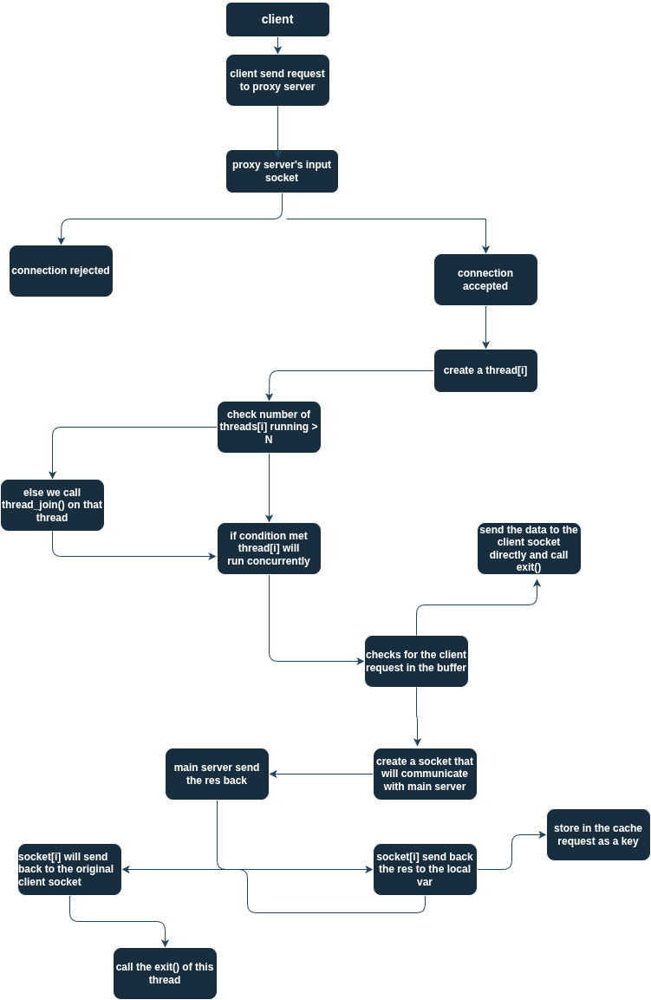

# 🌐 Multithreaded Web Proxy Server with LRU Cache

A high-performance HTTP proxy server built in C that handles multiple client connections concurrently using POSIX threads, featuring an intelligent LRU (Least Recently Used) caching mechanism for improved response times and reduced bandwidth usage.

Built with C, POSIX threads, semaphores, and socket programming, this proxy server delivers fast, concurrent request handling with efficient memory management and caching strategies.

## 📚 Index
- 🚀 [Features](#-features)
- 🏗️ [Architecture Overview](#️-architecture-overview)
- 📁 [Project Structure](#-project-structure)
- 🔧 [How It Works](#-how-it-works)
- 🚦 [Proxy Workflow](#-proxy-workflow)
- 🧠 [Cache Management](#-cache-management)
- 📊 [Run] (#-run)
- 🎥 [Demo] (#-demo)

## 🚀 Features

- 🔄 **Multithreaded Architecture** - Handles up to 50 concurrent client connections
- 🧠 **LRU Cache Implementation** - Intelligent caching with automatic memory management
- ⚡ **High Performance** - Semaphore-based connection control for optimal resource usage
- 🔒 **Thread Safety** - Mutex locks ensure data integrity across concurrent operations
- 🌍 **HTTP/1.1 & HTTP/1.0 Support** - Compatible with standard HTTP protocols
- 🎯 **Dynamic Port Binding** - Automatically assigns available system ports
- 📝 **Comprehensive Error Handling** - Proper HTTP status codes (400, 403, 404, 500, 501, 505)
- 🔧 **Memory Management** - Efficient allocation and deallocation of resources
- 📡 **Socket Programming** - Raw socket implementation for network communication

## 🏗️ Architecture Overview





## 🔧 How It Works

### Core Components

**🔗 Connection Management**
- Maximum 50 concurrent connections using semaphores
- Each client connection spawns a dedicated thread
- Automatic resource cleanup on connection termination

**📊 Request Processing**
- Parses incoming HTTP requests (GET method supported)
- Validates HTTP version compatibility
- Extracts host, path, and header information

**🎯 Cache System**
- LRU eviction policy for memory optimization
- Thread-safe operations with mutex locks
- Configurable cache size limits (1GB max, 8KB per element)

**🌐 Proxy Functionality**
- Forwards requests to destination servers
- Streams responses back to clients
- Maintains connection headers and proper HTTP formatting

## 🚦 Proxy Workflow

1. **Client Connection**: Client connects to proxy server on assigned port
2. **Request Reception**: Server receives and buffers HTTP request
3. **Cache Check**: System checks if response exists in LRU cache
4. **Cache Hit**: If found, serves cached response immediately
5. **Cache Miss**: If not found, forwards request to destination server
6. **Response Forwarding**: Streams server response back to client
7. **Cache Storage**: Stores response in cache for future requests
8. **Connection Cleanup**: Closes connections and frees resources

## 🧠 Cache Management

### LRU Implementation
- **Time-based Tracking**: Each cache entry tracks last access time
- **Automatic Eviction**: Removes least recently used items when memory limit reached
- **Thread Safety**: Mutex locks protect cache operations from race conditions
- **Memory Efficiency**: Dynamic allocation with proper cleanup

### Cache Features
- Maximum cache size: 1GB
- Maximum element size: 8KB
- Automatic URL-based indexing
- Real-time memory usage tracking

### Run

```bash
# Run the project
make run

# Test with wget
wget -e http_proxy=localhost:8080 https://news.ycombinator.com/

# or run in the local browser turn of browser cache
```

## 🎥 Demo

👉 [Demo](./Demo.png)